# Microservice Project Algo

1. Init new repository
2. Transferred project starter kit to new repository
3. Stubbed the project submission screenshots in /screenshots and added one for Github Travis Webhook
4. Set my environment variables in my ~/.bash_profile:

```
export POSTGRES_USERNAME=;
export POSTGRES_PASSWORD=;
export POSTGRES_DB=udagrammercerdev;
export POSTGRES_HOST=udagrammercerdev.chy5z7qtq32g.us-east-2.rds.amazonaws.com;

export AWS_REGION=us-east-2;
export AWS_PROFILE=default;
export AWS_BUCKET=udagram-mercer-dev;

export JWT_SECRET=
export URL=http://localhost:8100
```

5. Deleted package-lock.json file transferred from original microservice /project folder
6. Created new README to outline steps taken (this README :))
7. Renamed udagram-api as backend-user-api and copied backend-user-api as backend-feed-api
8. Removed superfluous code from respective backend api's (feed from user, and users from feed)
9. **Local** individual testing: ensure that after the backend reorg everything works locally (individually).
  - Front end ✅
  - Back end user ✅
  - Back end feed ✅

**I tried to run both backend API's and realized there both set to same port so can't test locally without changing the frontend app to use different ports for users and feed.
Found this discussion and decided to test from containers versus changing the ports:**
https://knowledge.udacity.com/questions/238085

10. From step 9, I have to build the images for the respective apps and figure out how to use docker compose to simultaneous building. So created the respective Dockerfile's.
11. cd into each app component (frontend, backend feed, backend user) and build the docker images

Docker cmd's for each service, pushing them to a new repository I created to house all the microservices:

**https://hub.docker.com/repository/docker/mercicle/microservice-project**

```
docker build –t udagram-frontend .
docker tag udagram-frontend mercicle/microservice-project:frontend
docker push mercicle/microservice-project:frontend

docker build –t udagram-backend-user .
docker tag udagram-backend-user mercicle/microservice-project:user
docker push mercicle/microservice-project:user

docker build –t udagram-backend-feed .
docker tag udagram-backend-feed mercicle/microservice-project:feed
docker push mercicle/microservice-project:feed

```

12. Success screenshots


But, a warning for node-pre-gyp during the backend builds:


13. Test if the images show how on Dockerhub ❌
14. I forgot to :tag the images when pushing so changed step 11 to include :tag in the tag and push steps. Then checked Dockerhub for success ✅.


15. Testing the builds with ```docker run ``` I received an error:
```UnhandledPromiseRejectionWarning: SequelizeConnectionRefusedError: connect ECONNREFUSED 127.0.0.1:5432```

But remembered (thanks to this article) need to pass in the env variables (duh!):
https://knowledge.udacity.com/questions/230407
and https://docs.docker.com/engine/reference/run/

```
docker run --rm --publish 8080:8080 $HOME/.aws:/root/.aws --env POSTGRES_HOST=$POSTGRES_HOST --env POSTGRES_USERNAME=$POSTGRES_USERNAME --env POSTGRES_PASSWORD=$POSTGRES_PASSWORD --env POSTGRES_DB=$POSTGRES_DB --env AWS_REGION=$AWS_REGION --env AWS_PROFILE=$AWS_PROFILE --env AWS_BUCKET=$AWS_BUCKET --env JWT_SECRET=$JWT_SECRET --env URL=$URL --name feed mercicle/microservice-project
```

However, I still get this error:

```
mercicle:backend-feed-api mercicle$ docker run --rm --publish 8080:8080 $HOME/.aws:/root/.aws --env POSTGRES_HOST=$POSTGRES_HOST --env POSTGRES_USERNAME=$POSTGRES_USERNAME --env POSTGRES_PASSWORD=$POSTGRES_PASSWORD --env POSTGRES_DB=$POSTGRES_DB --env AWS_REGION=$AWS_REGION --env AWS_PROFILE=$AWS_PROFILE --env AWS_BUCKET=$AWS_BUCKET --env JWT_SECRET=$JWT_SECRET --env URL=$URL --name feed mercicle/microservice-project
**docker: invalid reference format: repository name must be lowercase.**

```
Then submitted this help ticket https://knowledge.udacity.com/questions/241351 and found out I was missing the ```--volume``` in Step 15 and have added it.

```
docker run --rm --publish 8080:8080 --volume $HOME/.aws:/root/.aws --env POSTGRES_HOST=$POSTGRES_HOST --env POSTGRES_USERNAME=$POSTGRES_USERNAME --env POSTGRES_PASSWORD=$POSTGRES_PASSWORD --env POSTGRES_DB=$POSTGRES_DB --env AWS_REGION=$AWS_REGION --env AWS_PROFILE=$AWS_PROFILE --env AWS_BUCKET=$AWS_BUCKET --env JWT_SECRET=$JWT_SECRET --env URL=$URL --name feed mercicle/microservice-project
```

This was successful to run the container and tested using:

```
> docker exec -t 6dbbc1be61d2 sh
> curl --location --request GET http://localhost:8080/api/v0/feed
{"count":0,"rows":[]}
```

16. Setting up deployment docker compose yaml files and nginx reverseproxy in /deployment/docker folder.
From https://docs.docker.com/compose/:
  - Define your app’s environment with a Dockerfile so it can be reproduced anywhere.
    - Here the app is the reverseproxy that acts as a single point of contact for the services
  - Define the services that make up your app in docker-compose.yml so they can be run together in an isolated environment.
    - this contains the 2 backend and 1 frontend service as well as the reverseproxy service.
  - Run docker-compose up and Compose starts and runs your entire app.

17. Build the reverse proxy image from deployment folder:

```
docker build –t reverseproxy .
docker tag reverseproxy mercicle/microservice-project:reverseproxy
docker push mercicle/microservice-project:reverseproxy

```

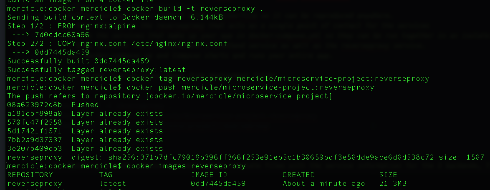

18. Updating the k8s service and deployment template files from class with the service information for the 2 backends, frontend, and reverseproxy in /deployment/k8s

19 Testing docker-compose-build

`docker-compose -f docker-compose-build.yaml build --parallel`

[Docker Compose Build Success Log](./logs/docker-compose-build-success-log.txt)

`docker-compose -f docker-compose-build.yaml push`
[Docker Compose Push Success Log](./logs/docker-compose-push-success-log.txt)

Error! ❌ Forgot to prefix the images with the account/repository:[service name] to locate where to push them.
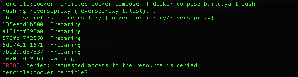

20. Fix the docker-compose account/repository:[service name] format error in deployment/docker-compose.yaml and docker-compose-build.yaml. Then ran again:
`docker-compose -f docker-compose-build.yaml build --parallel`

[Docker Compose Build Success Log](./logs/docker-compose-build-success-log-after-fix.txt)

`docker-compose -f docker-compose-build.yaml push`

[Docker Compose Push Success Log](./logs/docker-compose-push-success-log.txt)

Docker up error! ❌ Even after settings in docker-compose to use different ports I get a `port is already allocated` error.
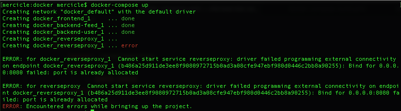

21. Fix the port error above by: had to docker kill another running container on that port.

docker-compose up success ✅
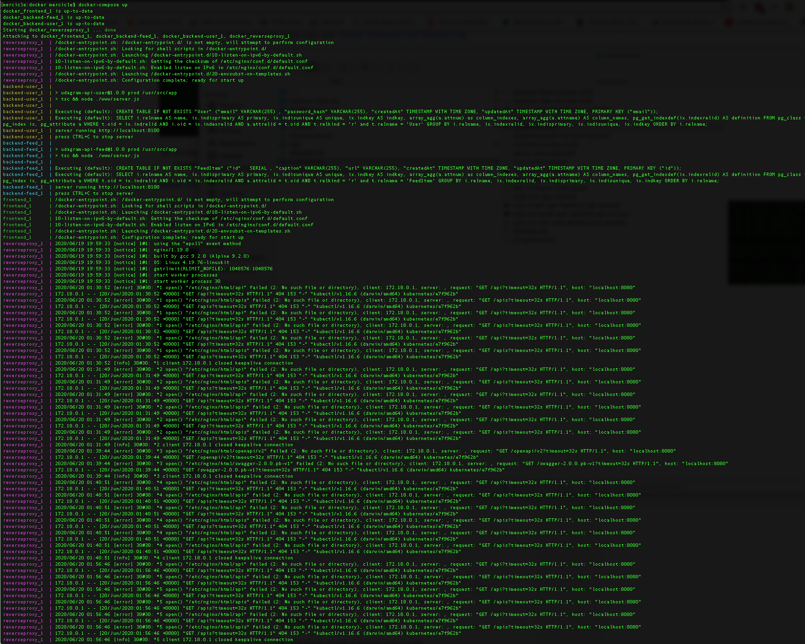

22. Create a EKS cluster name = `k8s-eks-cluster-for-microservice-refactor` and node group `k8s-eks-cluster-for-microservice-refactor`

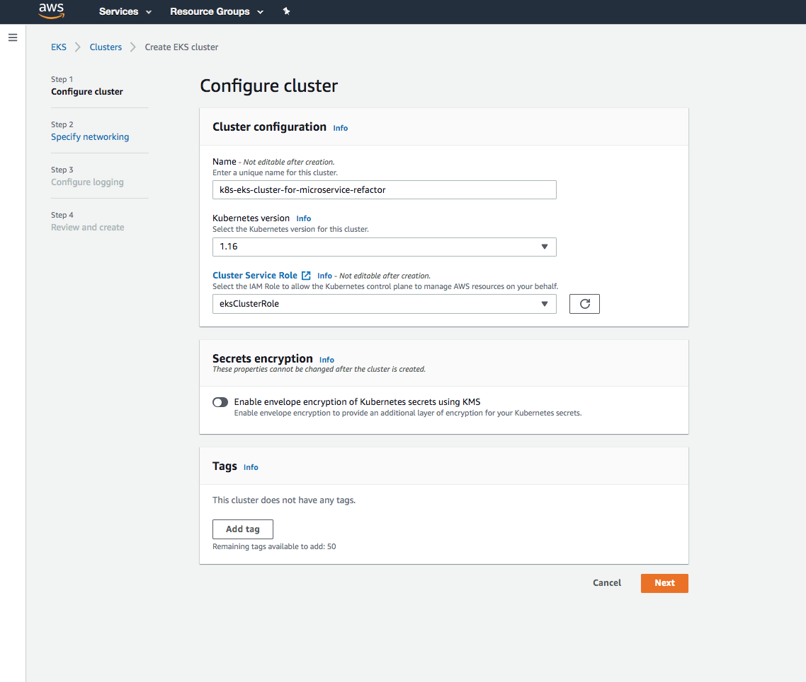
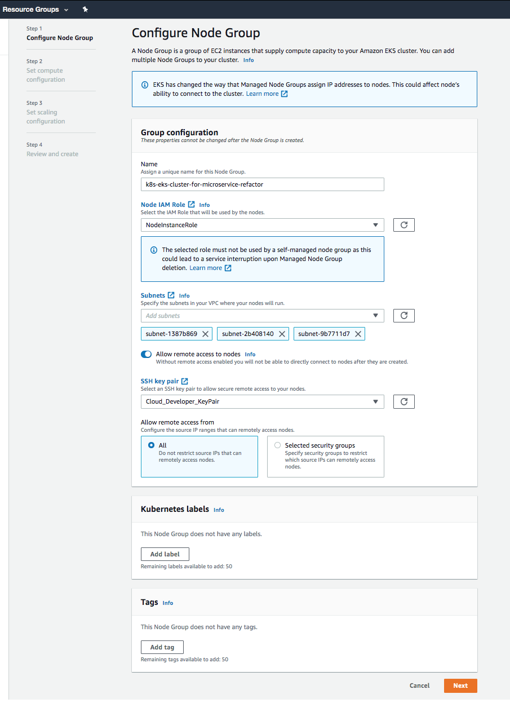

**note to self:** node group role creation - https://docs.aws.amazon.com/eks/latest/userguide/worker_node_IAM_role.html#create-worker-node-role

23. A this point, we're ready to deploy to EKS k8s! I've already installed:
  -  installed kubectl
  -  setup aws-iam-authenticator
  -  setup kubeconfig

24. From lesson 5. we'd deploy via: `kubectl apply -f deployment.yaml`

`kubectl apply -f deployment.yaml`
`kubectl apply -f service.yaml`

Before this, found from thread https://knowledge.udacity.com/questions/191887 that need to create: env-configmap.yaml, env-secret.yaml, aws-secret.yaml in deployment/k8s folder.

25. kubectl describe services ❌
```
> kubectl describe services
error: the server doesn't have a resource type "services"
```

26. Don't know how to translate the docker-compose framework to k8s? Mentor response, I totally forgot this command:

`aws eks --region <region-code> update-kubeconfig --name <cluster_name>`

So executed: `aws eks --region us-east-2 update-kubeconfig --name k8s-eks-cluster-for-microservice-refactor`

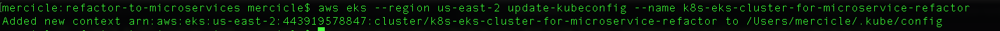

But when trying to run `kubectl cluster-info` got unauthorized ❌ error:
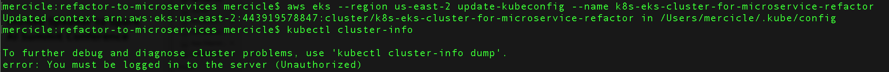

27. From this google search [eks-api-server-unauthorized-error](https://aws.amazon.com/premiumsupport/knowledge-center/eks-api-server-unauthorized-error/)
Found that running:
`aws sts get-caller-identity`

The Arn needs to match that of the one used to create the cluster! The Arn response was:

```
> aws sts get-caller-identity
{
    "UserId": "...",
    "Account": "...",
    "Arn": "arn:aws:iam::443919578847:user/udagram-john-dev"
}

```

but my cluster creator IAM was:

`arn:aws:iam::443919578847:role/eksClusterRole`

28. How do I reset the Arn so that it matches the one I used to create the cluster? I tried to assign udagram-john-dev to a eks group:

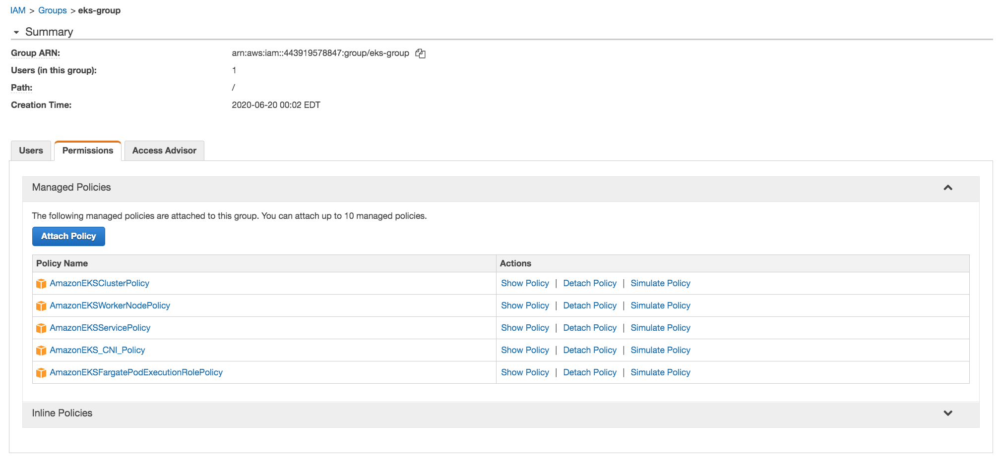

But still receive the unauthorized ❌ error.

29. After setting my password for IAM user, logging in, and creating a cluster while logged in as udagram-john-dev, executed:

`aws eks --region us-east-2 update-kubeconfig --name k8s-eks-cluster-for-microservice-refactor-v2`

then  `kubectl cluster-info`:

And success!! ✅ See below:

```
> aws eks --region us-east-2 update-kubeconfig --name k8s-eks-cluster-for-microservice-refactor-v2
Added new context arn:aws:eks:us-east-2:443919578847:cluster/k8s-eks-cluster-for-microservice-refactor-v2 to /Users/mercicle/.kube/config
> kubectl cluster-info
Kubernetes master is running at https://22136E75A708DB483307430E082179FC.sk1.us-east-2.eks.amazonaws.com
CoreDNS is running at https://22136E75A708DB483307430E082179FC.sk1.us-east-2.eks.amazonaws.com/api/v1/namespaces/kube-system/services/kube-dns:dns/proxy
To further debug and diagnose cluster problems, use 'kubectl cluster-info dump'.

```

30. Before moving on to CD with k8s, I need to finish the CI using Travic CI .travis.yml file for automatically running docker compose and docker push to docker hub. This thread in the forum was very helpful!

[How to use travis to build multiple containers with docker-compose?](https://knowledge.udacity.com/questions/176828)

31. Travis ran successfully

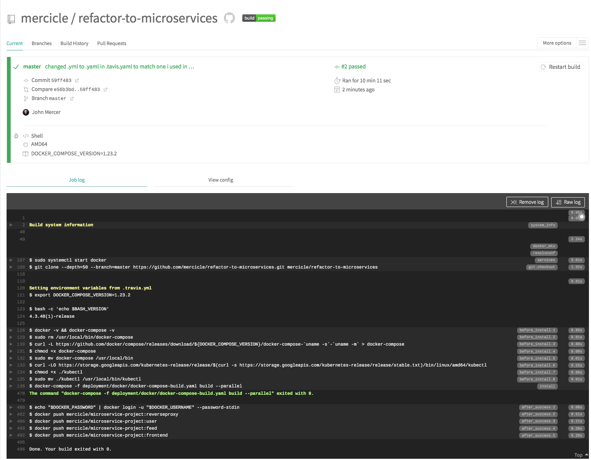

And full Travis CI success log is here:
[Travis CI Docker Compose Build Success Log](./logs/travis-docker-compose-build-push-success-log.txt)

However, I don't see the images updated in Docker Hub ❌ - I had this problem before and  but no resolution.


32. After debugging there was two issues:
  - My tags in the final push were not set correctly.
  - When entering the password into Travis env vars, the special characters needed to be escaped!

[Travis CI Docker Compose Build Success Log Confirmed on Dockerhub](./logs/travis-docker-compose-build-push-success-log-confirmed-dockerhub.txt)

** Travic CI is now successfully up and running, on to the CD! **

33. Corrected my image names in the respective k8s-deployment yaml's to use the full [account]/[repository]:tag

34. Deploy using kubectl:

kubectl apply -f deployment.yaml

```
kubectl apply -f k8s-deployment-feed.yaml
kubectl apply -f k8s-service-feed.yaml

kubectl apply -f k8s-deployment-user.yaml
kubectl apply -f k8s-service-user.yaml

kubectl apply -f k8s-deployment-reverseproxy.yaml
kubectl apply -f k8s-service-reverseproxy.yaml

kubectl apply -f k8s-deployment-frontend.yaml
kubectl apply -f k8s-service-frontend.yaml
```
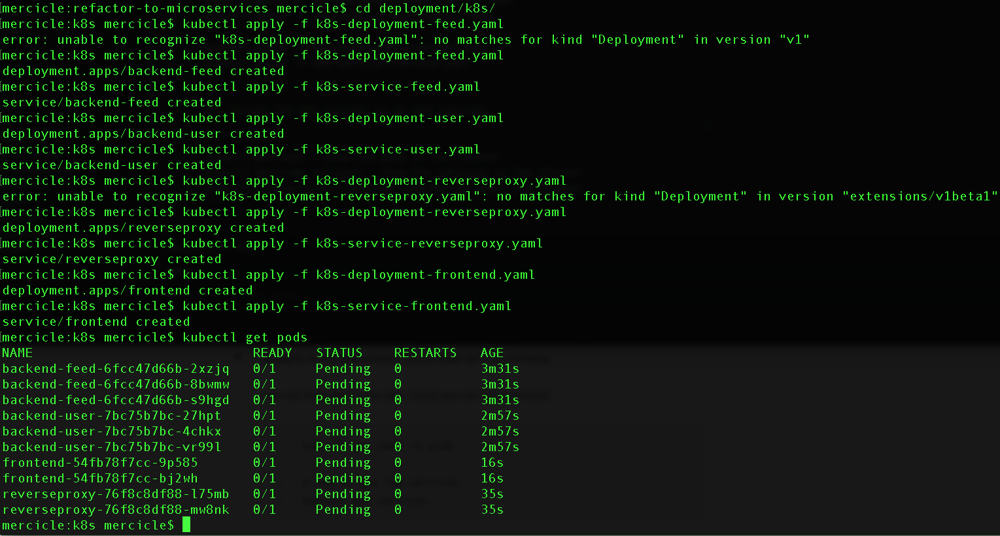

35. Verify the k8s cluster is up and running:

```
kubectl get pods - show the pods in the cluster
kubectl describe services - show the services in the cluster
kubectl cluster-info - display information about the cluster
```

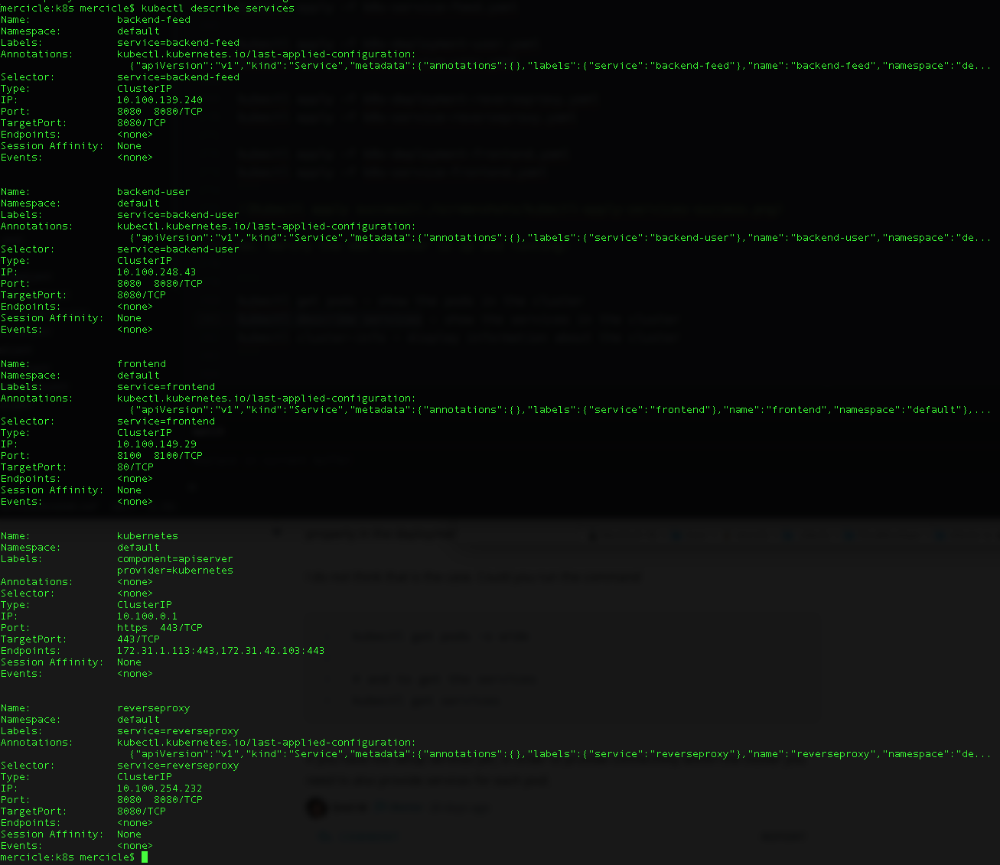

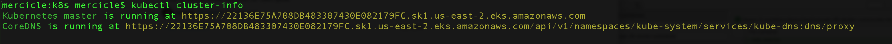


36. Setup Horizontal Pod Autoscaler

`kubectl autoscale deployment <DEPLOYMENT_NAME> --cpu-percent=<DESIRED_THRESHOLD> --min=<MIN_PODS> --max=<MAX_PODS>`

```
kubectl autoscale deployment backend-feed --cpu-percent=50 --min=1 --max=10
kubectl autoscale deployment backend-user --cpu-percent=50 --min=1 --max=10
kubectl autoscale deployment frontend --cpu-percent=50 --min=1 --max=10
kubectl autoscale deployment reverseproxy --cpu-percent=50 --min=1 --max=10
kubectl get hpa
```

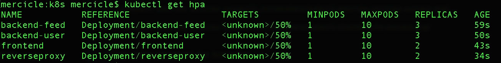
