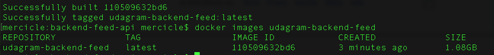
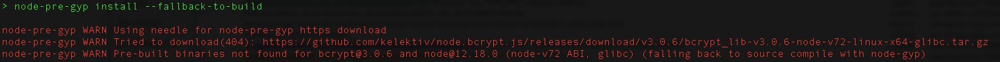
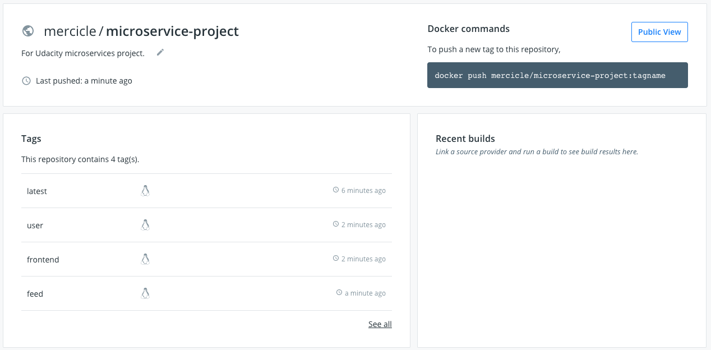

# Microservice Project Algo

1. Init new repository
2. Transferred project starter kit to new repository
3. Stubbed the project submission screenshots in /screenshots and added one for Github Travis Webhook
4. Set my environment variables in my ~/.bash_profile:

```
export POSTGRES_USERNAME=;
export POSTGRES_PASSWORD=;
export POSTGRES_DB=udagrammercerdev;
export POSTGRES_HOST=udagrammercerdev.chy5z7qtq32g.us-east-2.rds.amazonaws.com;

export AWS_REGION=us-east-2;
export AWS_PROFILE=default;
export AWS_BUCKET=udagram-mercer-dev;

export JWT_SECRET=
export URL=http://localhost:8100
```

5. Deleted package-lock.json file transferred from original microservice /project folder
6. Created new README to outline steps taken (this README :))
7. Renamed udagram-api as backend-user-api and copied backend-user-api as backend-feed-api
8. Removed superfluous code from respective backend api's (feed from user, and users from feed)
9. **Local** individual testing: ensure that after the backend reorg everything works locally (individually).
  - 9a. Front end ✅
  - 9b. Back end user ✅
  - 9c. Back end feed ✅

**I tried to run both backend API's and realized there both set to same port so can't test locally without changing the frontend app to use different ports for users and feed.
Found this discussion and decided to test from containers versus changing the ports:**
https://knowledge.udacity.com/questions/238085

10. From step 9, I have to build the images for the respective apps and figure out how to use docker compose to simultaneous building. So created the respective Dockerfile's.
11. cd into each app component (frontend, backend feed, backend user) and build the docker images

Docker cmd's for each service, pushing them to a new repository I created to house all the microservices:

**https://hub.docker.com/repository/docker/mercicle/microservice-project**

```
docker build –t udagram-frontend .
docker tag udagram-frontend mercicle/microservice-project:frontend
docker push mercicle/microservice-project:frontend

docker build –t udagram-backend-user .
docker tag udagram-backend-user mercicle/microservice-project:user
docker push mercicle/microservice-project:user

docker build –t udagram-backend-feed.
docker tag udagram-backend-feed mercicle/microservice-project:feed
docker push mercicle/microservice-project:feed

```

12. Success screenshots





But, a warning for node-pre-gyp during the backend builds:


13. Test if the images show how on Dockerhub ❌
14. I forgot to :tag the images when pushing so changed step 11 to include :tag in the tag and push steps. Then checked Dockerhub for success ✅.


